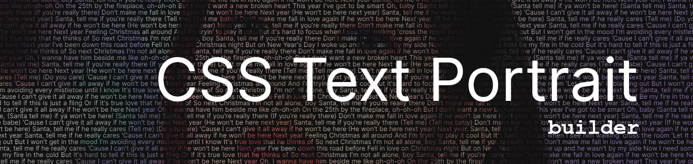
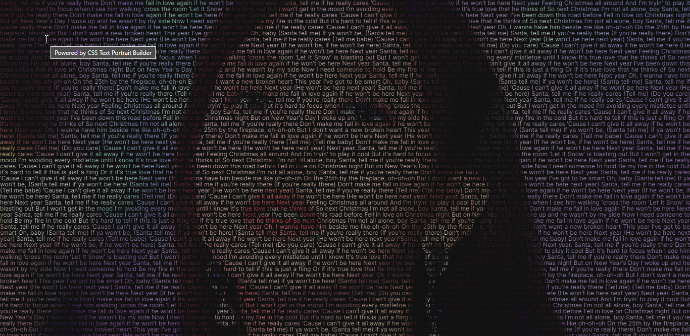

# CSS Text Portrait Builder

[](https://github.com/warengonzaga) [](https://wrngnz.ga/discord) [](https://github.com/warengonzaga/css-text-portrait-builder/releases) [](https://github.com/warengonzaga/css-text-portrait-builder/stargazers) [](https://github.com/warengonzaga/css-text-portrait-builder/blob/main/license)

📢 Nominate ([@WarenGonzaga](https://warengonzaga.com)) as **[GitHub Star](https://stars.github.com/nominate)**. If you appreciate his hardwork and dedication to open source.

[](https://github.com/warengonzaga/css-text-portrait-builder)

A trending pure CSS text portrait builder for your loved ones. 🥰 You don't need to waste your time just to create it from scratch and spend time working on its CSS sorcery. Here's the builder just for you! ✨

## 😎 Demo

This **Nayeon CSS Text Portrait** below is created using CSS Text Portrait Builder.
I use colored high-resolution image with lyrics from [Nayeon's Santa Tell Me](https://www.youtube.com/watch?v=XO9GiPOLd3I) for the text.

[](https://css-text-portrait-builder.vercel.app)

### ✨Community Showcase

- your build url here.

## ⚡ Features

- Auto-fill screen with text.
- Responsive build output.
- Optimized builds.
- Easy to use, no-code friendly.
- Filter settings (will add).

Have suggestions? Let me know!

## 📖 Documentation

The complete documentation can be found here:

[](https://docs.warengonzaga.com/css-text-portrait-builder)

## 🕹️ Usage

To build your own pure CSS text portrait, you need to meet the requirements below.

### 📋 Requirements

- NodeJS LTS version.
- Terminal/CMD/Bash installed or access.
- High resolution image in JPG format.

If you meet the requirements above then proceed to the steps below.

### 📝 Building Steps

1. Rename your image to `bg.jpg` (it should be in JPG, we don't need PNG lol).
2. Place your image inside `src/img`, just replace the existing image.
3. Now, edit `config.json` inside `src` folder.
4. Replace the text object inside with your own text. It can be a lyrics, a message, or a passage from a book its up to you! (I prefer personal message if this is for your loved one.)
5. Open your terminal/cmd/bash and type:

    ```cmd
    yarn install
    ```

6. Once done, type:

   ```bash
   yarn run build
   ```

7. Lastly, you need to serve your builds, type:

    ```bash
    yarn run serve
    ```

    A local server should open at port `1234`
    > e.g. <http://localhost:1234>

8. You're done! 🎉

> **Note**: The output is not locally accessible. Meaning can't be viewed on your local machine without being served. I'm currently working on packaging the output after building.

### 📡 Hosting

To learn more about hosting your builds check out the [community discussion](https://github.com/warengonzaga/css-text-portrait-builder/discussions).

## 🎯 Contributing

Contributions are welcome, create a pull request to this repo and I will review your code. Please consider to submit your pull request to the `dev` branch. Thank you!

Read the project's [contributing guide](./CONTRIBUTING.md) for more info.

## 💬 Discussions

For any questions, suggestions, ideas, or simply you want to share your experience in using this project, feel free to share and discuss it to the [community](https://github.com/warengonzaga/css-text-portrait-builder/discussions)!

## 🐛 Issues

If you're facing a problem in using CSS Text Portrait Builder please let me know by [creating an issue here](https://github.com/warengonzaga/css-text-portrait-builder/issues/new). I'm here to help you!

## 🍀 Sponsors and Supporters

[](https://buymeacoff.ee/warengonzaga) [](https://vercel.com) [](https://vercel.com) [](https://gitbook.io) [](https://digitalocean.com) [](https://deepware.ai/) [](https://nowpayments.io) [](https://stackhawk.com)

> Love what I do? **[Send me some coffees](https://buymeacoff.ee/wareneutron)**! ☕☕☕
>
> Can't send coffees? 😥 Nominate me for a **[GitHub Star](https://stars.github.com/nominate)** instead!
> Your coffee donation and support will help me to continue working on open-source projects like this. 🙏😇

## 🌏 Community

Join to my growing tech community and get the latest updates!

[](https://wrngnz.ga/discord) [](https://wareneutron.com/discord)

## 📋 Code of Conduct

Read the project's [code of conduct](./code_of_conduct.md).

## 📃 License

CSS Text Portrait Builder is licensed under [The MIT License](https://opensource.org/licenses/MIT).

## 📝 Author

CSS Text Portrait Builder is created by **[Waren Gonzaga](https://github.com/warengonzaga)**, with the help of awesome [contributors](https://github.com/warengonzaga/css-text-portrait-builder/graphs/contributors).

---

💻 Made with 💖 and ☕ by **Waren Gonzaga** with **YHWH** 🙏 | **[Citizen of Heaven](https://youtu.be/GwirdlbkUD8?t=150)** ▶️

[personal website]: https://warengonzaga.com
[business website]: https://wgcompanyhq.com
[biolink]: https://bio.link/warengonzaga
[facebook]: https://facebook.com/warengonzagaofficial
[twitter]: https://twitter.com/warengonzaga
[instagram]: https://instagram.com/warengonzagaofficial
[youtube]: https://youtube.com/warengonzaga
